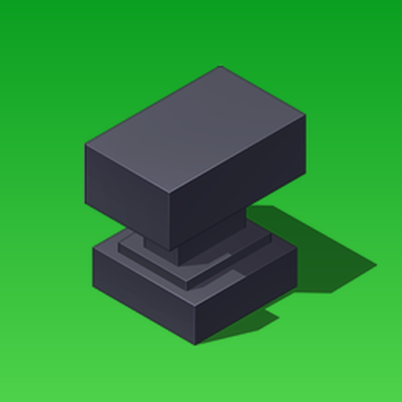

<div align="center">
  
  <h1>Bedrock Builder</h1>
  <p>Build tools for Minecraft Bedrock add-ons.</p>
  <p>
    <a href="https://www.npmjs.com/package/@aplok/bedrock-builder"></a>
    <a href="https://nodejs.org/"></a>
    <a href="LICENSE"></a>
    <a href="https://discord.com/invite/PppEgBdss4"></a>
  </p>
  <p>
    <a href="https://bedrock.trenbankai.dev/">Site</a>
    ·
    <a href="https://bedrock.trenbankai.dev/docs/">Docs</a>
    ·
    <a href="https://bedrock.trenbankai.dev/docs/getting-started/">Getting Started</a>
    ·
    <a href="https://bedrock.trenbankai.dev/docs/reference/cli/">CLI Reference</a>
  </p>
</div>

`bb` is a Node.js build tool for Bedrock projects. It bundles scripts with esbuild, copies both packs into `dist/`, deploys to a local game installation, and produces `.mcaddon` releases.

## What it does

- **Create** a Bedrock project with manifests, packs, TypeScript, and UUIDs.
- **Generate** common items, blocks, entities, recipes, loot, sounds, and more.
- **Build** scripts and pack files into a clean `dist/` directory with incremental builds.
- **Run** by deploying once or watching for changes.
- **Validate** configuration, manifests, references, icons, languages, and output.
- **Ship** a release build and `.mcaddon` archive.
- **Extend** the pipeline without adding media codecs or project-specific behavior to core.

## Install

```bash
npm install --save-dev @aplok/bedrock-builder
```

The package provides both `bb` and `bedrock-builder` binaries. They are aliases for the same CLI.

## Start a project

```bash
bb init my-addon
cd my-addon
npm install
bb check
bb build
bb run --watch
```

For a release:

```bash
bb ship
```

## Project layout

```text
my-addon/
├─ bedrock.config.json
├─ package.json
├─ tsconfig.json
├─ src/
│  └─ main.ts
├─ packs/
│  ├─ BP/                 behavior pack
│  └─ RP/                 resource pack
└─ dist/                  generated output, normally gitignored
```

`config.json` is also supported. The generated project uses the standard project shape:

```json
{
  "type": "minecraftBedrock",
  "name": "my-addon",
  "authors": ["you"],
  "targetVersion": "1.21.0",
  "packs": {
    "behaviorPack": "packs/BP",
    "resourcePack": "packs/RP"
  },
  "bb": {
    "version": "1.0.0",
    "entry": "src/main.ts",
    "out": "dist",
    "deploy": {
      "target": "retail"
    }
  }
}
```

The entry can be TypeScript or JavaScript. If omitted, `bb` probes `src/main.ts` and then `src/main.js`. `bb.version` takes precedence over the project package version.

## Daily commands

| Command                                | Purpose                                            |
| -------------------------------------- | -------------------------------------------------- |
| `bb init`                              | Create a project.                                  |
| `bb new --list`                        | List all generator types.                          |
| `bb new item ruby`                     | Generate a feature.                                |
| `bb build`                             | Create development output.                         |
| `bb build --release`                   | Create minified release output without sourcemaps. |
| `bb run`                               | Build and deploy once.                             |
| `bb run --watch`                       | Rebuild and deploy on changes.                     |
| `bb check`                             | Validate the project.                              |
| `bb harness --strict`                  | Validate references and treat warnings as errors.  |
| `bb ship`                              | Build and create a `.mcaddon`.                     |
| `bb clean`                             | Remove output and cache.                           |
| `bb diff`                              | Show changes since the previous build.             |
| `bb ext`                               | Inspect configured extensions.                     |
| `bb ext --install`                     | Install extension dependencies locally.            |
| `bb manifest`                          | Rewrite pack UUIDs and links.                      |
| `bb version 1.1.0`                     | Update the project version.                        |
| `bb publish --bump minor --tag --push` | Run the release workflow.                          |

Most build commands support `--json`. Add `--typecheck` to `build` or `ship` to run the project TypeScript check first.

## Generators

Use `bb new <type> [name]` to generate connected Bedrock files and registry entries. See the complete list with:

```bash
bb new --list
bb new item ruby
bb new weapon fire_sword --mode 3d
bb new block glow_block --light 12
bb new recipe ruby_sword --ingredients minecraft:stick,minecraft:diamond
```

Generators are safe to rerun: identical files are skipped, registries are merged, and conflicts stop unless `--force` is provided. Some generators can add related recipe, loot, and equipment files.

## Extensions

Extensions are enabled in your project configuration. The core exposes generic processor hooks; format-specific tools belong to the extension that uses them.

```json
{
  "bb": {
    "extensions": ["tga-converter"]
  }
}
```

The loader checks, in order, relative paths, project `node_modules`, `.builder/extensions`, the global extension directory, and repository samples. Missing or broken extensions warn and skip the build.

Each extension can have an `extension.json` for Builder metadata and a `package.json` for npm metadata and dependencies. Install dependencies into the extension itself:

```bash
bb ext --install
```

Bundled samples include `tga-converter`, `emissive-fixer`, and `json-cleaner`. They are examples and are not included in the npm package.

## Deployment

The default `retail` target discovers common Bedrock installations. Use a custom game directory when needed:

```json
{
  "bb": {
    "deploy": {
      "target": "custom",
      "customPath": "C:/path/to/com.mojang"
    }
  }
}
```

## API

The package also provides JavaScript and TypeScript APIs for builds, generators, validation, and extensions:

```typescript
import { build, loadConfig } from "@aplok/bedrock-builder";

const config = await loadConfig("./bedrock.config.json");
await build(config, { release: false });
```

Media codecs are not exported by core. Use the relevant extension instead.

## Requirements

- Node.js 20.19 or newer.
- Minecraft Bedrock for local deployment.

## Documentation

- [Website](https://bedrock.trenbankai.dev/)
- [Getting started](https://bedrock.trenbankai.dev/docs/getting-started/)
- [CLI reference](https://bedrock.trenbankai.dev/docs/reference/cli/)
- [Configuration](https://bedrock.trenbankai.dev/docs/reference/config/)
- [API reference](https://bedrock.trenbankai.dev/docs/reference/api/)

## License

zlib License. See [LICENSE](LICENSE).
